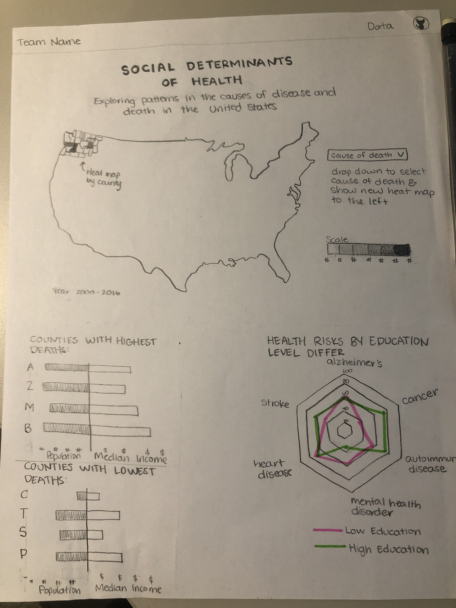

# The Social Determinants of Health
Team Morbid Curiosity: Paul, Sarah, Hannah, Connor

https://morbid-curiosity.herokuapp.com/
- - -

## Purpose
Analyze United States Mortality and Demographic Data to identify patterns in deaths in the United States. The hope with this project is that it sheds light on areas of concern in the United States that can be addressed by public health professionals to help Americans live longer and healthier lives.

## Data
The data we are pulling is from the CDC’s social vulnerability index and wonder (health) dataset. Our repository is located at this [link](https://github.com/hlbarker2/MorbidCuriosity).

## Methods

* ETL
* DB on AWS
* Flask app built with HTML/CSS, JS
* D3.js
* Leaflet.js
* Chart.js
* JustGage

## Visualizations

Our team created multiple, dynamic visualizations to illustrate life expectancy and mortality data:

* Heat map of deaths in the United States by county for a given year. There are drop-down menus to explore different health-related causes of death, population size, and Medicare spending in the United States. On selecting from the drop-down menu, the map reflects in a new heat map to show where causes of death impacted Americans most. 
* Scatter plot to illustrate the relationship between themes in the social vulnerability index and life expectancy
* Radar chart that compares the percentage of death from different diseases in men and women
* Bar chart that compares mortality rate among different population sizes
* Gauges that display per capita income, life expectancy and percentage of population with no high school diploma based on user input of his/her zip code
* Interactive sliders that predict life expectancy based on machine learning model
